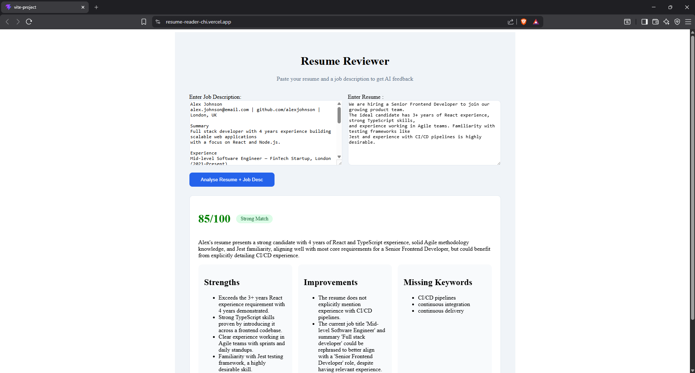

# Resume Reviewer

An AI-powered web app that analyses your resume against a job description, providing a match score, strengths, areas to improve, and missing keywords.

🔗 [Live Demo](https://resume-reader-chi.vercel.app/)




## Tech Stack

- **Frontend:** React, TypeScript, Vite, deployed on Vercel
- **Backend:** Node.js, Express, Typescript, Render
- **AI:** Google Gemini API (gemini-2.5-flash)

## Running Locally

### Prerequisites
- Node.js 18+
- A free Gemini API key from [Google AI Studio](https://aistudio.google.com)

### Backend
```bash
cd backend
npm install
# create a .env file with GEMINI_API_KEY=your_key and PORT=3001
npm run dev
```

### Frontend
```bash
cd frontend
npm install
# create a .env file with VITE_API_URL=http://localhost:3001
npm run dev
```

## What I Learned

This project taught me good practices for Typescript and its importance in production versus JavaScript. I learned about Restful endpoints and how to test using tools like Postman. Also I learned about prompt engineering and how to get AI's to cooperate and produce a useful result.